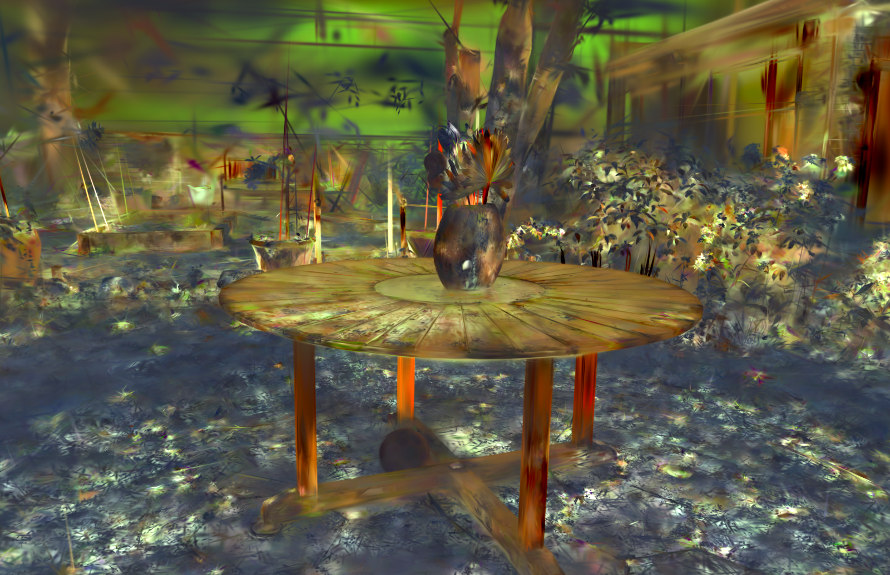
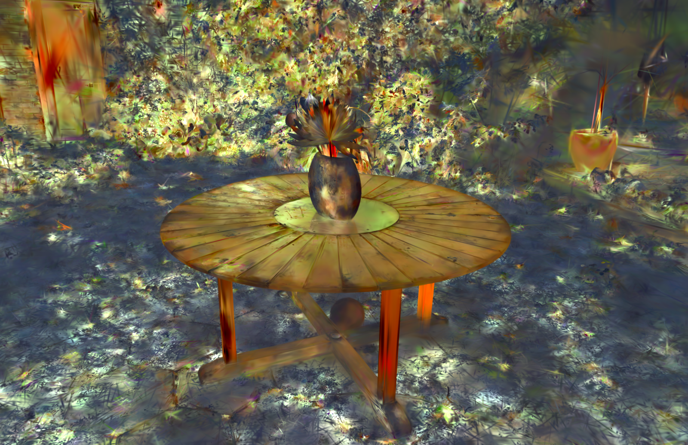
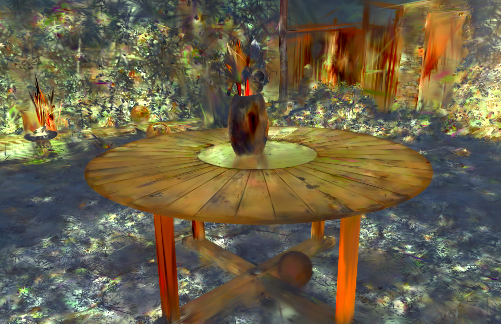
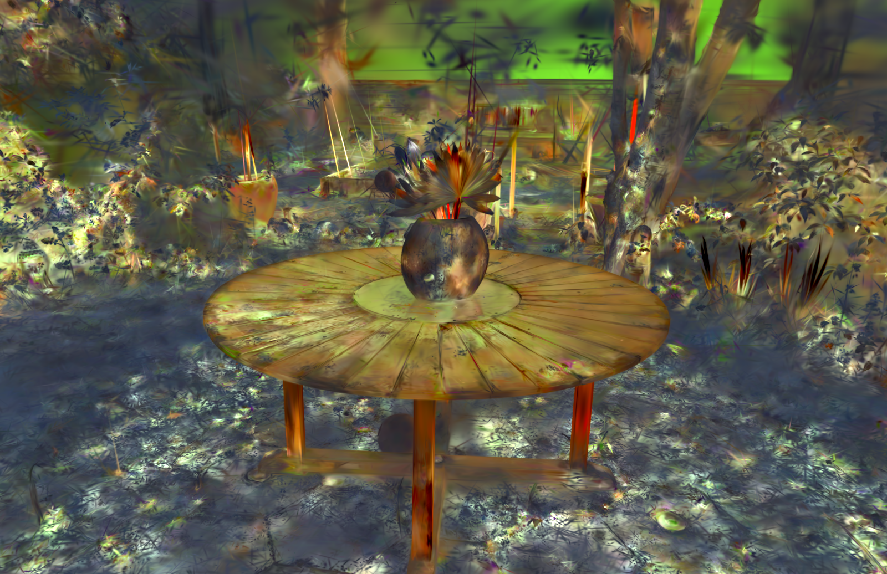
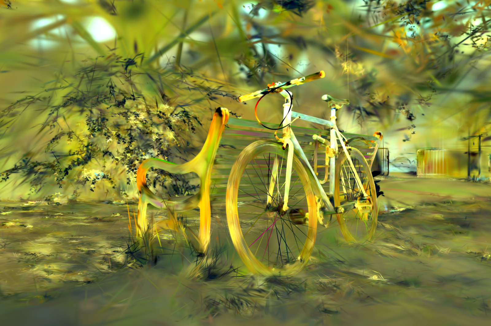
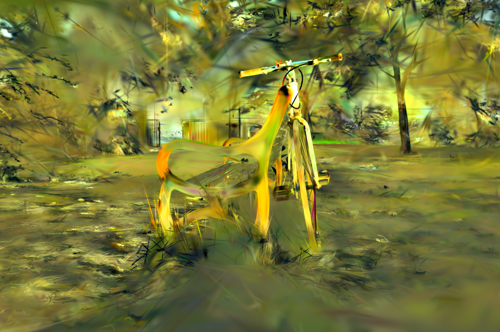
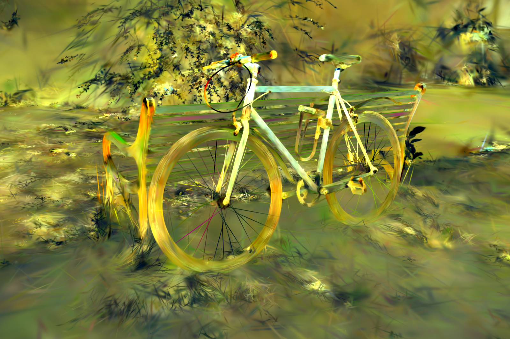
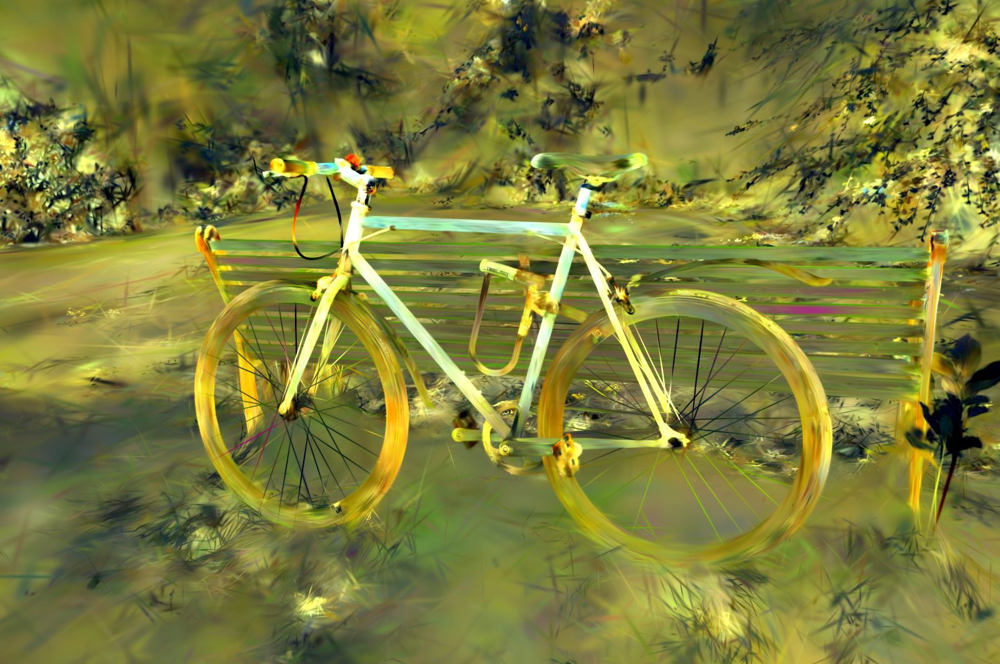
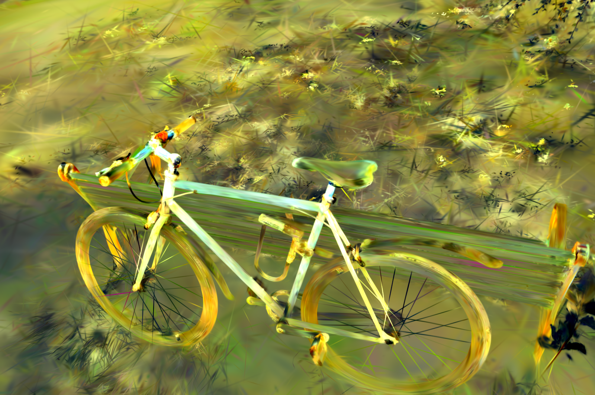

# 🖼️ M3GStyler: Enhancing Consistency across Multi-view in Multi-modality 3D Gaussian Style Transfer

---

## 1 Environment Installation

```bash
conda env create -f environment.yml -n m2stylegs
```
## 2 Data Prepration

#### 2.1. Dataset download
Please download the scene datasets and put them in the `datasets` folder. 
1. [LLFF](https://github.com/Fyusion/LLFF)
2. [Tanks and Temples](https://www.tanksandtemples.org/)
3. [Mip-NeRF 360](https://jonbarron.info/mipnerf360/)

Please download the style images datasets [WikiArt Dataset](https://www.kaggle.com/datasets/ipythonx/wikiart-gangogh-creating-art-gan), unzip and renamed as `archive`, put them in the `datasets` folder. 


#### 2.2. Reconstruction Training and Feature Embedding Training
```bash
python train_reconstruction.py -s [dataset_path]

# for example:
python train_reconstruction.py -s datasets/orchids
```
The trained reconstruction model will be saved in the `output/[scene_name]/reconstruction` folder.

```bash
python train_feature.py -s [dataset_path] --ply_path [ply_path]

# for example:
python train_feature.py -s datasets/train --ply_path output/orchids/reconstruction/default/point_cloud/iteration_30000/point_cloud.ply
```
The trained feature embedding model will be saved in the `output/[scene_name]/feature` folder.

To facilitate reproducibility, we provide pre-trained checkpoints ([Google Drive](https://drive.google.com/drive/folders/1Q_esnarpdRYLMgMahG0JdJmVmYuT01xZ)); please place them in the `output/[scene_name]/feature` folder before use.

## 3. Style Transfer Training
```bash
python train_artistic.py -s [dataset_path] --wikiartdir [wikiart_path] --ckpt_path [feature_ckpt_path] --ode [flow number] --iters[training iters]  --alpha [ratio] --positional_embedding

# for example:
python train_artistic.py -s datasets/Caterpillar  --wikiartdir datasets/archive --ckpt_path output/Caterpillar/feature/default/chkpnt/feature.pth  --style_weight 10  --ode 3 --iters 10000 --alpha 0.1 --positional_embedding True 
```

#### Argument Description

- `-s`: Path to the training dataset.
- `--wikiartdir`: Path to the WikiArt dataset.
- `--ckpt_path`: Path to the checkpoint of the feature embedding model, formatted as:
- `--style_weight`: *(Optional)* Weight for the style loss.
- `--ode`: Number of segments for flow-based alignment.
- `--iters`: Number of training iterations for each flow alignment stage,  we recommend using a value within the range `[10000, 30000]`.
- `--alpha`: To balance high- and low-frequency components, the fusion weight should be set within the range `[0, 1]`; we recommend using a value of `0.1`.
- `--positional_embedding`: *(Optional)* For scenes with ambiguous foreground-background relationships, it can help accelerate training convergence.

The trained style transfer model will be saved in the `output/[scene_name]/artistic/` folder.

 we also provide pre-trained checkpoints ([Google Drive](https://drive.google.com/drive/folders/1yZqsB3HelGljwpRih46sAGjqqsxtkp6K)); please place them in the `output/[scene_name]/artistic/` folder before use.


## 4 Inference Rendering

### 4.1 Style Transfer with Image

You can perform style transfer on a scene with a single style image by:
```bash
python render.py -m [model_path]  --style [style_image_path] 

# for example:
python render.py -m output/garden/artistic/default_10000 --style images/14.jpg 
```
#### Argument Description

- `-m`: Path to the pre-trained model, named as `output/[scene_name]/artistic/[exp_name]`.
- `--style_image_path`: Path to the style image.

The rendered stylized multi-view images will be saved in the `output/[scene_name]/artistic/[exp_name]/train` folder.

<p align="center">
  
  
  
  
  
</p>

### 4.2 Style Trasfer with Text
You can also perform style transfer on a scene with any text description by:
```bash
python render.py -m [model_path]  --text [text_reference] 

# for example:
python render.py -m output/flower/artistic/default_10000 --text 'Waterlily by Monet' 
```
#### Argument Description

- `-m`: Path to the pre-trained model, named as `output/[scene_name]/artistic/[exp_name]`.
- `--text`: The text prompt of artistic style.

The rendered stylized multi-view images will be saved in the `output/[scene_name]/artistic/[exp_name]/train` folder.

<div align="center">

<p><b>The oilpainting of sunflowers by Van Gogh</b></p>







</div>

### 4.3 Render Video
To generate a video output, add `--render_video` to the commands in Section 4.1 or 4.2.

<p align="center">
  
  
</p>


## 5 Acknowledgements

Our work is based on [3D Gaussian Splatting](https://github.com/graphdeco-inria/gaussian-splatting), [StyleRF](https://github.com/Kunhao-Liu/StyleRF), [Conrf](https://github.com/xingy038/ConRF) and [StyleGaussian](https://github.com/Kunhao-Liu/StyleGaussian). We thank the authors for their great work and open-sourcing the code.


